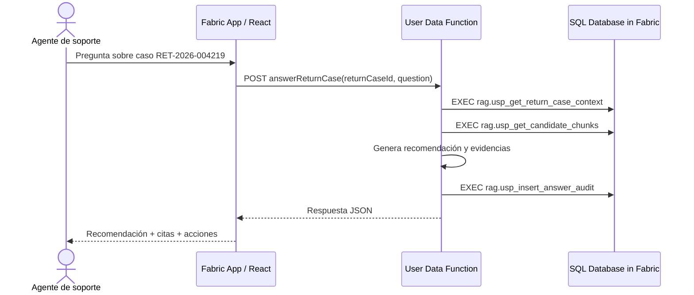

# Arquitectura de la demo

## Objetivo

Construir una aplicación RAG de extremo a extremo en Microsoft Fabric para FraSoHome, mostrando que SQL sigue siendo la capa de control: filtros, reglas, permisos, trazabilidad y auditoría.

## Componentes

### SQL Database in Microsoft Fabric

Contiene datos transaccionales y conocimiento de negocio:

- `fraso.*`: clientes, pedidos, líneas, productos, stock y casos de devolución.
- `rag.Documents`: políticas internas versionadas.
- `rag.Chunks`: fragmentos recuperables con metadatos.
- `rag.ChunkEmbeddings`: embeddings en JSON para fallback portable.
- `rag.AnswerAudit`: auditoría de la pregunta, recuperación, recomendación y evidencias.

### User Data Functions

`answerReturnCase` implementa el backend RAG:

1. Recupera contexto operacional del caso.
2. Recupera chunks candidatos con T-SQL.
3. Calcula la recomendación aplicando reglas transparentes.
4. Genera respuesta con evidencias.
5. Registra auditoría en SQL.

### Fabric App / Rayfin

Frontend React/Vite con:

- Selector de caso de devolución.
- Pregunta RAG.
- Respuesta, evidencias, motivos y acciones.
- Autenticación Microsoft Entra para invocar el endpoint UDF.

## Flujo de llamada

